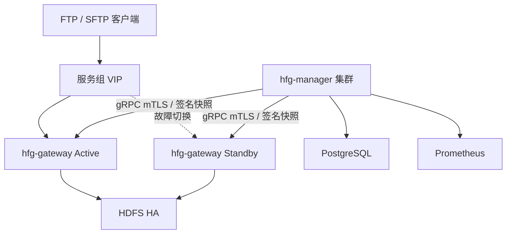

# HFG 系统设计与实现说明

## 1. 技术选型

HFG 的数据面和管理面后端统一使用 Java 17。FTP 需要成熟的命令状态机、被动端口与文件系统适配，SFTP 需要完整 SSH/SFTP 协议栈，HDFS 又以 Java API、UGI、Kerberos 和 Hadoop 配置文件为原生集成方式。Apache FtpServer、Apache MINA SSHD 与 Hadoop FileSystem 的组合可以避免实现自有协议栈，降低协议兼容与安全风险。管理页面使用 React、TypeScript、Semi Design 和 VChart，视觉语言按 new-api 新版的侧边导航、卡片、低饱和背景和数据看板风格实现。

## 2. 运行架构

每个服务组由一个 VIP、一个 Active 节点和一个 Standby 节点组成。可以部署多个互相独立的服务组，并共享同一套 Manager 和 PostgreSQL。Keepalived 只迁移 VIP；已有 TCP 会话不跨节点恢复，客户端必须重连。续传仅允许从 HDFS 暂存文件 EOF 继续。

管理面可以横向部署。配置版本由 PostgreSQL advisory lock 串行生成；不同 Manager 实例发布的快照会由网关心跳检测版本差异并推送到本实例的 gRPC 订阅者。

## 3. 模块边界

| 模块 | 关键职责 | 禁止依赖 |
|---|---|---|
| hfg-common-contract | 领域枚举、DTO、错误码、签名快照、gRPC Protobuf | 协议和 Hadoop 实现 |
| hfg-storage-api | 顺序读写、目录、原子 rename、配额抽象 | Hadoop |
| hfg-storage-hdfs | Hadoop FileSystem、Kerberos UGI、proxy user/doAs | FTP/SFTP |
| hfg-policy-engine | 虚拟路径规范化、最长前缀映射、读写 ACL | 协议 |
| hfg-traffic-control | Token Bucket、连接/传输并发、周期边界 | 数据库 |
| hfg-transfer-core | 统一上传下载生命周期、暂存提交、事件 | 具体协议 |
| hfg-protocol-ftp | Apache FtpServer 用户与文件系统适配 | Hadoop |
| hfg-protocol-sftp | MINA SSHD 认证与 SFTP 文件访问器 | Hadoop |
| hfg-gateway-control-client | Ed25519 验签、原子快照落盘、mTLS gRPC | Manager 业务实现 |
| hfg-gateway-app | 组装数据面、健康检查、指标、事件 WAL | 管理页面 |
| hfg-manager-domain | 用户领域服务与乐观锁契约 | Web/JPA |
| hfg-manager-infrastructure | JPA、Flyway、PostgreSQL 实现 | 协议 |
| hfg-manager-api | REST、gRPC、配额租约、目录配置、审计、Prometheus 代理 | 页面 |
| hfg-manager-web | new-api 风格管理页面 | Hadoop/数据库 |

## 4. 数据面流程

### 4.1 登录与授权

1. FTP/SFTP 从当前不可变快照读取用户。
2. 校验账号状态、有效期、BCrypt 密码；SFTP 还可校验 OpenSSH 公钥。
3. 规范化客户端虚拟路径，拒绝 `..` 越界。
4. 按最长虚拟目录前缀找到 HDFS 路径映射。
5. 按 READ_ONLY 或 READ_WRITE 校验操作。
6. 使用管理端下发配置包中的 keytab principal 建立 UGI；不再把 FTP/SFTP 用户映射为 HDFS proxy user。

已发布快照包含密码哈希而非明文。网关只接受 SHA-256 和 Ed25519 都正确、服务组一致且版本递增的快照。Manager 不可用时继续使用磁盘上最后一个有效快照。

### 4.2 上传原子性

上传目标 `/dir/file.bin` 的数据先写入同目录的 `/dir/.uploading/<transfer-id>.part`。成功时执行 flush、close，再原子 rename 到最终路径。最终路径在提交前不可见。中断后客户端只能从暂存文件 EOF 继续；任意偏移写入返回 UNSUPPORTED_OFFSET。覆盖模式会在提交阶段处理已存在目标。

### 4.3 下载

下载打开 HDFS 输入流后执行 seek，支持从合法偏移读取。实际读取字节数才计入限速与用量，避免以调用方缓冲区容量过度计费。

### 4.4 流控与配额

| 控制项 | 执行位置 | 算法 |
|---|---|---|
| 上传/下载字节每秒 | Gateway | 按用户、方向的 Token Bucket |
| 上传/下载并发 | Gateway | 公平 Semaphore |
| 最大连接 | FTP 协议层；SFTP 由传输并发约束 | 快照策略 |
| 周期文件数 | Manager + PostgreSQL | 事务行锁精确预留 |
| 周期字节数 | Manager + PostgreSQL | 64 MiB 租约分段预留 |
| HDFS namespace/space quota | HDFS | DistributedFileSystem quota |

配额租约有过期回收。传输完成提交实际用量，失败释放预留；即使 Manager 提交调用异常，本地并发许可也必须释放。周期使用账号配置的时区计算 DAY、WEEK、MONTH 边界。

## 5. 管理功能

- 用户：分页查询、创建、修改、启停、删除、重置密码、OpenSSH 公钥管理；上述操作均已接入管理页面。
- 目录：创建时绑定用户并设置只读/读写权限，同时维护虚拟目录/HDFS 路径映射、自动创建、namespace/space 配额、失败状态与重试。
- 权限：用户可见目录及只读/读写授权。
- 流控：字节速率、突发量、连接/传输并发、周期文件数和字节数。
- 看板：今日汇总、24 小时趋势、用户历史、连接历史、流控窗口。
- 监控告警：Prometheus instant/range query 代理、规则和通知渠道配置。
- 系统：上传并解析 HDFS XML/Keytab ZIP、服务组、VIP、Gateway 客户端证书，以及包含 IP/端口的节点心跳状态。
- 配置发布：管理页面按服务组查看并发布版本化 Ed25519 签名快照，经 gRPC 推送到主备 Gateway。
- 审计：所有管理 REST 的 POST、PUT、DELETE 记录操作者、路径、状态、来源和关联 ID，不记录请求体或密钥。

## 6. 数据一致性

- 用户写操作使用 HTTP `If-Match` revision 和 JPA `@Version`。
- 配置快照版本在事务内按服务组加 PostgreSQL advisory lock。
- 传输事件主键为 `transfer_id + event_sequence`，批量上报幂等。
- Gateway 先写本地 JSON Lines WAL，再批量上报，网络失败保留待重试。
- 周期配额依赖数据库行锁，不能用 Prometheus 指标代替结算账本。
- 目录创建采用最终一致性：数据库先提交 PENDING，后台任务配置 HDFS，结果变为 READY 或 FAILED。

## 7. 安全边界

- 生产优先 SFTP；明文 FTP 只能位于可信网络，默认关闭主动模式并固定被动端口范围。
- Manager gRPC 默认要求双向 TLS；证书 SAN 必须匹配 `HFG_RPC_SERVER_NAME`。Gateway 客户端证书由 Manager 使用 Java 密码学 API 和配置的 CA 签发并下载，私钥只在生成响应中出现一次。
- SFTP 主机密钥必须持久化并在主备节点保持一致。
- HDFS ZIP 和解压后的 keytab 仅保存在 Manager 受控数据目录，并通过 mTLS gRPC 控制通道下发到 Gateway；证书 CN、请求 Gateway ID 与登记服务组进行绑定校验。数据库密码、管理密码、CA 私钥和 TLS 私钥禁止写入仓库。
- 管理 REST 当前采用 HTTP Basic，生产必须位于 HTTPS 反向代理后；可在不改变领域层的情况下替换为企业 OIDC。
- SFTP 禁用 shell、exec、软链接和属性写入，只暴露 SFTP 子系统。

## 8. 可观测性

Gateway 与 Manager 暴露 `/actuator/health/readiness` 和 `/actuator/prometheus`。指标标签只使用协议、方向、状态、错误码和服务组等低基数字段，不把用户名、路径、transfer ID 放入 Prometheus 标签。用户级分析使用 PostgreSQL 事件表。

## 9. 已知运行约束

- VIP 切换不迁移存量 TCP 会话。
- HDFS rename 的原子性要求暂存路径与目标路径位于同一 HDFS 命名空间和目录树。
- FTP 主动模式默认关闭；当前实现不提供 FTPS，生产公网接入应使用 SFTP 或在受控网络入口做 TLS 终止。
- VChart/Semi Design 当前生产包较大，后续可按路由动态加载看板模块；依赖中的 lottie-web 会触发构建器 direct-eval 警告，业务代码未调用 eval。
